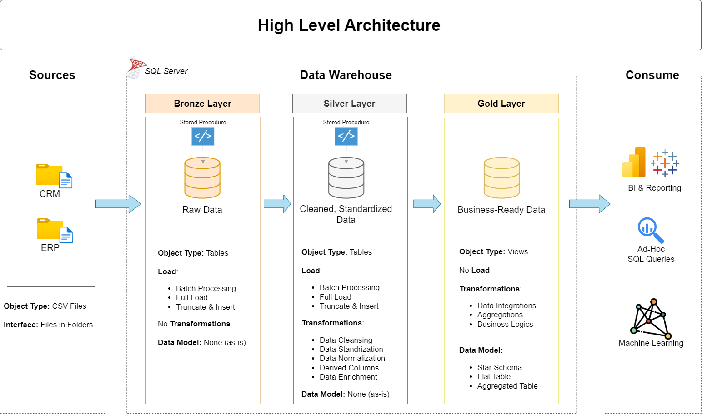

# Data Warehouse and Analytics Project (DBT)

Welcome to the **Data Warehouse and Analytics Project** repository! 🚀  
This project demonstrates a comprehensive data warehousing and analytics solution, from building a data warehouse to generating actionable insights. Designed as a portfolio project, it highlights industry best practices in data engineering and analytics.

---

## 🏗️ Data Architecture

The data architecture for this project follows Medallion Architecture **Bronze**, **Silver**, and **Gold** layers:


1. **Bronze Layer**: Stores raw data as-is from the source systems. Data is ingested from CSV Files into SQL Server Database.
2. **Silver Layer**: This layer includes data cleansing, standardization, and normalization processes to prepare data for analysis.
3. **Gold Layer**: Houses business-ready data modeled into a star schema required for reporting and analytics.

---

## 📖 Project Overview

This project involves:

1. **Data Architecture**: Designing a Modern Data Warehouse Using Medallion Architecture **Bronze**, **Silver**, and **Gold** layers.
2. **ETL Pipelines**: Extracting, transforming, and loading data from source systems into the warehouse.
3. **Data Modeling**: Developing fact and dimension tables optimized for analytical queries.
4. **Analytics & Reporting**: Creating SQL-based reports and dashboards for actionable insights.

🎯 This repository is an excellent resource for professionals and students looking to showcase expertise in:

- SQL Development
- Data Architect
- Data Engineering
- ETL Pipeline Developer
- Data Modeling
- Data Analytics

---

## Project Structure

```text
amazon/
  dbt_project.yml
  models/
    bronze/
    silver/
    gold/
    schema.yml
    sources.yml
  tests/
  macros/
  seeds/
  snapshots/
```

### Main folders

- dbt_project.yml: Project configuration and materialization rules
- models/: Contains all dbt models and schema tests
- tests/: Contains singular tests for custom data quality checks
- macros/: Custom dbt macros
- seeds/: Seed data files
- snapshots/: Snapshot configurations

---

## Implemented Models

### Bronze Layer

These models load or stage the source data into the warehouse:

- bronze_crm_cust_info
- bronze_crm_prd_info
- bronze_crm_sales_details
- bronze_erp_cust_az12
- bronze_erp_loc_a101
- bronze_erp_px_cat_g1v2

### Silver Layer

These models clean and standardize the data for downstream analytics:

- silver_crm_cust_info
- silver_crm_prd_info
- silver_crm_sales_details
- silver_erp_cust_az12
- silver_erp_loc_a101
- silver_erp_px_cat_g1v2

### Gold Layer

These models provide business-ready analytics tables:

- dim_customers
- dim_products
- fact_sales

---

## Generic Tests Implemented

Generic tests are defined in models/schema.yml and are applied to the silver layer models.

### Included test types

- unique
- not_null
- accepted_values

### Examples of columns tested

- Customer ID, customer key, and first/last name fields
- Product ID, category ID, product name, and cost fields
- Sales order, product key, customer ID, sales amount, quantity, and price fields
- Gender and marital status values with allowed values

These tests help ensure that critical fields are populated and that values stay within expected business rules.

---

## Singular Tests Implemented

Singular tests are stored in the tests/ folder and validate relationships between models.

### Current singular tests

- cust_info_az12_test.sql
  - Validates that customer information aligns with ERP customer data for AZ12
- cust_info_loc_test.sql
  - Validates that customer information aligns with ERP location data
- prd_cat_test.sql
  - Validates that product information aligns with ERP product category data
- sales_prd_cust_test.sql
  - Validates that sales data can be linked correctly to products and customers

These tests are useful for enforcing cross-model business logic and data integrity.

---

## How to Set Up This Project

### 1. Prerequisites

Make sure you have:

- Python installed
- dbt Core installed
- The correct adapter for your warehouse:
  - dbt-databricks for Databricks
  - dbt-snowflake for Snowflake

### 2. Install dbt and the adapter

Example:

```bash
pip install dbt-core
pip install dbt-databricks
# or
pip install dbt-snowflake
```

### 3. Create your profiles.yml file

dbt uses a profiles.yml file to connect to your warehouse. On macOS, the file is typically stored at:

```text
~/.dbt/profiles.yml
```

### 4. Run dbt commands

From the project folder:

```bash
dbt deps
dbt debug
dbt run
dbt test
```

---

## Connecting to Databricks or Snowflake with profiles.yml

### Databricks example

```yaml
amazon:
  target: dev
  outputs:
    dev:
      type: databricks
      schema: analytics
      host: https://<your-workspace>.cloud.databricks.com
      http_path: /sql/1.0/warehouses/<warehouse-id>
      token: { { env_var('DATABRICKS_TOKEN') } }
      catalog: main
```

### Snowflake example

```yaml
amazon:
  target: dev
  outputs:
    dev:
      type: snowflake
      account: <your-account>
      user: <your-user>
      password: { { env_var('SNOWFLAKE_PASSWORD') } }
      role: SYSADMIN
      warehouse: <your-warehouse>
      database: <your-database>
      schema: analytics
```

> Replace the placeholder values with your actual warehouse credentials and environment settings.

---

## Recommended dbt Workflow

```bash
dbt run
dbt test
dbt docs generate
dbt docs serve
```

This workflow helps you build the models, validate the data quality rules, and inspect the generated documentation locally.

---

## Summary

This dbt project demonstrates:

- Medallion architecture implementation
- Bronze, Silver, and Gold modeling
- dbt generic tests and singular tests
- Warehouse connectivity through profiles.yml
- A reusable analytics foundation for CRM and ERP data

## 🛡️ License

This project is licensed under the [MIT License](LICENSE). You are free to use, modify, and share this project with proper attribution.

## 🌟 About Me

Hi there! I'm **Muhammad Abbas**. I’m an IT professional and passionate about data engineering.

## 🙏 Special Thanks

A special thanks to **Data With Baraa** for creating outstanding data engineering and analytics content. Your tutorials, open-source projects, and educational resources have been incredibly valuable in helping me learn and improve my skills.

- **GitHub:** https://github.com/DataWithBaraa
- **YouTube:** https://www.youtube.com/@DataWithBaraa

Thank you for sharing your knowledge with the community and making high-quality learning resources freely accessible. Your work is greatly appreciated.
